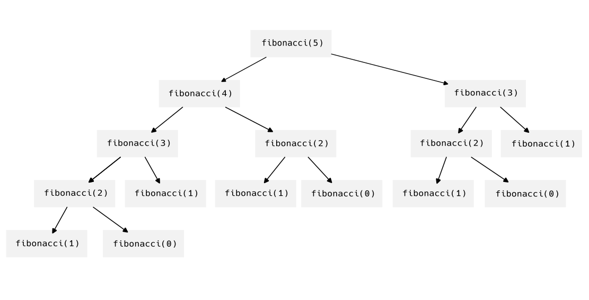

# Secuencia de fibonacci

Es una secuencia muy conocida en el mundo matematico, la cual se define de forma recursiva como:

- \\( f_0 = 0 \\)

- \\( f_1 = 1 \\)

- \\( f_n = f_{n-1} + f_{n-2} \quad \forall n \geq 2 \\)

Podemos echar un poco las cuentas y ver que la secuencia va de la siguiente forma: \\( 0, 1, 1, 2, 3, 5, 8, 13, 21, \ldots \\)

## En código

Podemos ocupar la siguiente función definida en python para calcular la secuencia de fibonacci:

```python
def fibonacci(n):
    if n == 0:
        return 0
    elif n == 1:
        return 1
    else:
        return fibonacci(n-1) + fibonacci(n-2)

print(fibonacci(10))
```

Como es claro, los casos base son los dos primeros valores de la secuencia. Mientras que el resto se calcula revisando el valores de los anteriores valores de la secuencia.

En C++ el código sería el siguiente:

```cpp
~#include <iostream>
~using namespace std;
~
int fibonacci(int n) {
  if (n == 0) {
      return 0;
  } else if (n == 1) {
      return 1;
  } else {
      return fibonacci(n-1) + fibonacci(n-2);
  }
}

~int main() {
  cout << fibonacci(10) << endl;
~  return 0;
~}
```

## Desventaja

El problema con esta implementación es que se están calculando mismo valores de la suceción varias veces.

Podemos hacer un dibujito de las llamdas que hace nuestra función `fibonacci`. 



Se aprecia que, por ejemplo, se calcula `fibonacci(3)` dos veces que no está mal. Pero notemos que `fibonacci(2)` se llega a calcular tres veces. Para números más grandes este problema se vuelve peor. De hecho la complejidad de esta función es de \\( \mathcal{O}(\phi^n) \\), donde \\( \phi = \frac{1+\sqrt{5}}{2} \\). Ya que la cantidad de llamadas para `fibonacci(n)` es precisamente el número de fibonacci \\( n \\), que por una fórmula conocida es 
\\[ f_n = \frac{ (\phi)^n - (\Phi)^n }{\sqrt{5}} \\]
donde \\( \Phi = \frac{1-\sqrt{5}}{2} \\). 

Más adelante veremos una solución a esta situación. Pera adelantamos desde ya que dicha optimización hace que el algoritmo se vuelva de complejidad lineal.