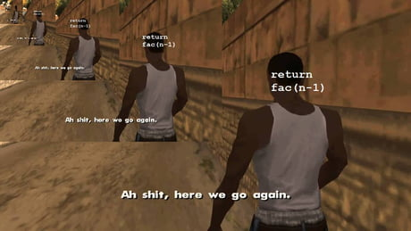

# Recursión

La recursión es una técnica de programación que se utiliza para resolver problemas de forma muy elegante. La idea es pensar en una función que se llama a sí misma hasta que se alcanza la solución. 

La recursón debe poseer un caso base, el cual va a ser la última vez que se llame a la función. Caso contrario, nuestra función no terminaría. 

De buenas a primeras no es tan fácil ver la recursión en los problemas, por lo cual es útil revisar unos típicos algoritmos de ejemplo.

